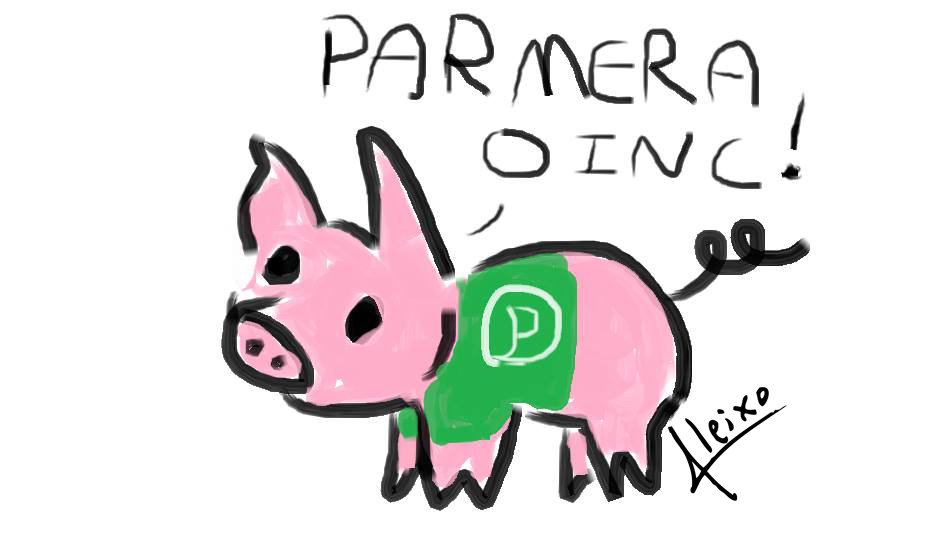

# ReadMe

<!-- 

 
 
 -->

# Titulo
<!-- ## Titulo
### Titulo
#### Titulo -->
<!-- 
<h1>Titulo</h1>
<h2>Titulo</h2>
<h3>Titulo</h3>
<h4>Titulo</h4>
<h5>Titulo</h5> -->

<!-- Este é um parágrafo do meu README, que tem como objetivo apresentar uma documentação válida -->

Este é um parágrafo do meu README, que tem como objetivo apresentar uma documentação válida 

Conteúdo
<ul>
    <li><a href="#">Bem vindo</a>
    </li>
</ul>
<ul>
    <li><a href="#">Bem vindo</a>
    </li>
</ul>
<ul>
    <li><a href="#">Bem vindo</a>
    </li>
</ul>

<h4>🚀Status</h4>
<h5>... em construção</h5>